# Qlik Generation Agent — Complete Technical Documentation & Architecture Guide

## 1. Overview & Purpose

The **Qlik Generation Agent** is a deterministic transformation engine that takes a **Contract 2.0 mapping payload** (produced from Qlik Sense apps) and transforms it into native Microsoft Power BI and Microsoft Fabric artifacts:
- **TMDL (Tabular Model Definition Language)** for the Semantic Model.
- **PBIR (Power BI Enhanced Report Format, schemas 2.0/2.9/3.2)** for the visual report.
- **PBIP (Power BI Project)** packaging format for opening in Power BI Desktop or syncing via Git in Fabric.

> **Deterministic Architecture**:
> Unlike earlier iterations, **no LLM is invoked during artifact generation**. The mapping is a pure deterministic transform: identical inputs produce byte-identical outputs, ensuring stable Git diffs, zero hallucinations, fast response times, and resilience against AI service limits.

---

## 2. End-to-End System Architecture

```mermaid
graph TD
    Client([Caller / UI / Orchestration]) -->|POST /generate| API[app/api/routes.py]
    API -->|app_id / run_id| MongoSource[app/sources/mapping_client.py]
    MongoSource -->|Fetch Mapping JSON| MongoAPI[(MongoDB Microservice)]
    API --> Orchestrator[app/generator.py]

    subgraph "Core Generation Engine"
        Orchestrator -->|1. Build Model| SemanticModel[app/model/semantic_model.py]
        SemanticModel --> TableTMDL[app/model/table_tmdl.py]
        SemanticModel --> MeasureTMDL[app/model/measure_tmdl.py]
        SemanticModel --> RelTMDL[app/model/relationship_tmdl.py]
        SemanticModel --> ParamTMDL[app/model/parameters_tmdl.py]
        SemanticModel --> DateTMDL[app/model/local_date_table.py]

        Orchestrator -->|2. Build Report| ReportWriter[app/report/report_writer.py]
        ReportWriter --> VisualBuilder[app/report/visual_builder.py]
        ReportWriter --> VisualCatalog[app/report/visual_catalog.py]
        ReportWriter --> LayoutEngine[app/report/layout.py]
        ReportWriter --> ThemeEngine[app/report/theme.py]
        ReportWriter --> FiltersEngine[app/report/filters.py]
        ReportWriter --> BookmarkEngine[app/report/bookmarks.py]

        Orchestrator -->|3. Assemble PBIP| PBIPPackager[app/package/pbip_packager.py]
        Orchestrator -->|4. Validate| Validator[app/package/validator.py]
    end

    subgraph "Delivery & Deployment Layer"
        PBIPPackager --> Disk[Local Disk: generated/app/run/]
        PBIPPackager --> Cache[app/package/package_store.py]
        Orchestrator --> DeployRouter{deploy param}
        DeployRouter -->|none| Done([Return GenerateResponse])
        DeployRouter -->|fabric| FabricDeploy[app/deploy/fabric_deployer.py]
        DeployRouter -->|github| GitHubDeploy[app/deploy/github_deployer.py]
        DeployRouter -->|devops| DevOpsDeploy[app/deploy/devops_deployer.py]
    end

    API -->|POST /download| ZipBuilder[app/package/zip_builder.py]
    ZipBuilder --> Stream([Streaming PBIP .zip])
```



---

## 3. API Surface & Endpoints

The HTTP API is implemented using **FastAPI** (`main.py`) and routed through `app/api/routes.py`.

### 3.1 Endpoints Table

| Method | Path | Handled By | Purpose |
|---|---|---|---|
| `POST` | `/generate`<br>`/api/generate`<br>`/generation`<br>`/tmdl` | `generate_endpoint` | Builds the semantic model and report; executes optional deployment; returns artifact metadata, validation stats, and files. |
| `POST` | `/download`<br>`/api/download` | `download_endpoint` | Streams the generated package as a `.zip` file for Power BI Desktop. Prefers in-memory cache, rebuilding on-demand if cache is cold. |
| `GET` | `/visual-support` | `visual_support` | Returns visual catalog: native mappings, substituted mappings with advice, and manual visual placeholders. |
| `GET` | `/health`<br>`/api/health`<br>`/` | `health` | Health check, deployment readiness (GitHub, DevOps, Fabric), mapping API status, and output directory. |

---

### 3.2 Request Model (`GenerateRequest`)

Defined in `app/schemas.py`:

```jsonc
{
  "run_id": "run-2026-09-12-001",           // Execution ID or UUID
  "app_id": "qlik-app-guid-1234",           // Qlik application ID
  "app_name": "Sales & Inventory",          // Display name for artifacts
  "target": "powerbi_desktop",              // powerbi_desktop | fabric | semantic_model_only
  "deploy": "none",                         // none | fabric | github | devops
  "mapping_result": { ... },                // Optional inline mapping payload (avoids DB fetch)

  // Fabric Deployment Parameters
  "workspace_id": "4a212d5c-...",           // Fabric workspace GUID
  "fabric_access_token": "Bearer ey...",    // Microsoft Fabric Bearer token
  
  // Git Deployment Parameters (GitHub / DevOps)
  "branch": "main",                         // Target branch
  "repo": "qlik-migration-repo",            // Target repository
  "org": "my-enterprise-org",               // Organization / Tenant
  "token": "ghp_...",                       // GitHub PAT or Azure DevOps PAT
  "commit_message": "Automated migration",

  // Generation Flags
  "write_to_disk": true,                    // Persist to local generated/ folder
  "push_only": false,                       // If true, skips local disk persistence
  "include_artifacts": true,                // Return full file contents in response body
  "index_only": false                       // Return file path index instead of full file contents
}
```

#### Request Normalization & Aliases
`GenerateRequest` includes a Pydantic `@model_validator(mode="before")` that standardizes legacy and variant inputs:
- `deployment_type` $\rightarrow$ `deploy` (handles `direct_fabric`, `fabric`, `github`, `git`, `devops`, `azure_devops`).
- `fabric_group_id` $\rightarrow$ `workspace_id`.
- `git_pat`, `github_pat`, `git_token`, `pat` $\rightarrow$ `token`.
- Automatically assigns `push_only = True` for cloud deployments (`fabric`, `github`, `devops`) unless disk writing is explicitly requested.

---

### 3.3 Response Model (`GenerateResponse`)

```jsonc
{
  "status": "success",                      // success | warning | error
  "message": "Generated 12 tables, 29 measures, 15 relationships, 5 pages, 57 visuals.",
  "target": "powerbi_desktop",
  "deploy": "none",
  "app_id": "...",
  "app_name": "Sales & Inventory",
  "run_id": "...",
  "output_path": "c:/.../generated/sales-inventory/run-...",
  "file_count": 76,
  "total_bytes": 128450,
  "summary": {
    "semantic_model": {
      "tables": 12,
      "measures": 29,
      "relationships_written": 15,
      "relationships_skipped": 0,
      "dax_needs_rewrite": 0
    },
    "report": {
      "pages": 5,
      "visuals": 57,
      "native": 52,
      "substituted": 5,
      "manual": 0,
      "filters_applied": 18,
      "bookmarks": 3,
      "navigation_buttons": 20
    }
  },
  "visual_notes": [
    {
      "sheet": "Executive Summary",
      "title": "Distribution by Region",
      "qlik_type": "boxplot",
      "mapped_to": "columnChart",
      "severity": "substituted",
      "reason": "Power BI has no native box plot.",
      "suggestion": "Rendered as column chart of median. Install 'Box and Whisker chart' from AppSource."
    }
  ],
  "validation": { "ok": true, "errors": [], "warnings": [] },
  "deployment": { "status": "skipped", "reason": "no deployment requested" },
  "artifacts": {
    "pbip": "{ ... }",
    "semantic_model": { ... },
    "report": { ... }
  }
}
```

---

## 4. Component-by-Component Analysis

### 4.1 Orchestrator — `app/generator.py`
The orchestrator drives execution across 8 distinct phases:
1. **Identity & Fallbacks**: Resolves `app_name` and `run_id` with UTC timestamp fallbacks to prevent collisions.
2. **Telemetry**: Dispatches milestone actions asynchronously via `_TELEMETRY_POOL = ThreadPoolExecutor(max_workers=4)` to avoid blocking user generation requests on external logging endpoints.
3. **Semantic Model Generation**: Calls `build_semantic_model()` to produce all `.tmdl` files.
4. **Data File Provisioning**: If deploying to Fabric with raw CSV/QVD files, provisions them directly into a Fabric Lakehouse and rewrites TMDL storage paths from placeholders to live OneLake URLs.
5. **Report Generation**: Calls `build_report()` to generate pages, visuals, layout, theme, filters, and bookmarks.
6. **PBIP Packaging**: Encapsulates model and report folders, creates the root `.pbip` file, and saves the package in `package_store`.
7. **Disk Persistence**: Writes the hierarchy to `generated/<slug_app>/<slug_run>/` using Windows `MAX_PATH` safe paths (`\\?\`).
8. **Validation & Deployment**: Validates structural compliance and dispatches to Fabric, GitHub, or DevOps.

---

### 4.2 Semantic Model Generation — `app/model/`

| File | Responsibilities |
|---|---|
| `semantic_model.py` | Assembles `<App>.SemanticModel/`: `model.tmdl`, `database.tmdl`, `cultures/en-US.tmdl`, `.pbism`, `.platform`, diagram layout, and editor settings. |
| `table_tmdl.py` | Generates per-table TMDL files: column types, formats (`formatString`), partition declarations, and M Power Query source expressions (SQL Server, Oracle, Lakehouse, CSV). |
| `measure_tmdl.py` | Injects DAX measures and calculated columns into their owning tables. Automatically creates and populates a dedicated `_Measures` table for unassigned/orphan measures. |
| `dax_guard.py` | Analyzes generated DAX expressions for unbalanced parentheses/brackets, invalid operators, or raw Qlik syntax remnants, replacing fatal errors with safe `BLANK()` placeholders. |
| `relationship_tmdl.py` | Generates `relationships.tmdl`. Validates foreign-key and primary-key table/column existence, assigns cardinality (`manyToOne`, `oneToMany`), and sets active/inactive status. |
| `parameters_tmdl.py` | Transforms Qlik variable inputs into a calculated `Parameters` table (`DATATABLE`) enabling dynamic slicer-driven parameters in DAX. |
| `local_date_table.py` | Auto-generates hidden `LocalDateTable` hierarchies (Year, Quarter, Month, Day) for date/datetime columns. |
| `role_tmdl.py` | Converts Qlik Section Access rules into DAX Row-Level Security (RLS) roles in `roles.tmdl`. |
| `expressions_tmdl.py` | Extracts shared data source connections into `expressions.tmdl` for centralized connection management. |

---

### 4.3 Packaging & Deployment Layer

- **`app/package/pbip_packager.py`**:
  - Packages `<App>.SemanticModel/`, `<App>.Report/`, and `<App>.pbip`.
  - Emits `.gitignore` ignoring Desktop local caches (`*.pbix`, `.pbi/cache.abf`).
  - Writes files using `_win_safe_path()` to avoid Windows 260-character path limits.
- **`app/package/fabric_packager.py`**:
  - Splits the package into item-relative base64 `InlineBase64` parts.
  - Rewrites `definition.pbir` to bind directly to the newly created Fabric semantic model GUID (`pbiModelDatabaseName`).
- **`app/package/validator.py`**:
  - Validates package integrity: checks that `model.tmdl`, `report.json`, `pages.json`, and `.platform` exist, verifies all JSON files parse correctly, and flags missing field bindings.
- **`app/package/package_store.py` & `zip_builder.py`**:
  - Caches generated packages in-memory by `run_id`.
  - Builds in-memory ZIP streams for the `/download` endpoint.
- **Deployers (`app/deploy/`)**:
  - `fabric_deployer.py`: Deploys via Microsoft Fabric REST API (`/workspaces/{id}/items`), polls asynchronous operation status, and creates the model first so the report can bind to it.
  - `github_deployer.py` / `devops_deployer.py`: Uses Git Trees API and Azure DevOps REST APIs to create atomic commits.

---

## 5. Detailed Summary of Report Generation Code (`app/report/`)

The report generation subsystem turns Qlik sheets, visual objects, filters, themes, and navigation into **Power BI PBIR format (Power BI Enhanced Report format)**.

### 5.1 Output Directory Structure

```
<App>.Report/
├── definition.pbir                              // Binding pointer to Semantic Model
├── .platform                                    // Fabric item registration metadata
├── .pbi/localSettings.json                      // Power BI client settings
├── StaticResources/SharedResources/BaseThemes/
│   └── CY24SU10.json                           // Customized theme JSON
└── definition/
    ├── report.json                              // Report root & global filters
    ├── version.json                             // PBIR version declaration (2.0.0)
    ├── pages/
    │   ├── pages.json                           // Sheet ordering & active page
    │   └── <page_id>/
    │       ├── page.json                        // Page dimensions, background, page filters
    │       └── visuals/
    │           └── <visual_id>/
    │               └── visual.json              // Visual definition, queryState, formatting
    └── bookmarks/                               // Bookmarks & navigation states
        ├── bookmarks.json
        └── <bookmark_id>.bookmark.json
```

---

### 5.2 Deep Dive into Each Report Generation Component

#### 1. `report_writer.py` — Master Report Assembler
- **Field & Entity Lookups (`_entity_maps`)**:
  - Dynamically inspects tables, columns, master dimensions, and measures in the mapping payload.
  - Maps physical columns to host tables and normalized names (lowercase, underscores replaced by spaces and vice versa).
  - Parses Master Dimension DAX formulas (e.g. `'Sales'[TransactionDate]`) using regular expressions to determine exact target tables and properties.
  - Auto-registers unresolved expression labels (`_auto_register_expression_labels`) into `_Measures` so visual queries can reference them without throwing errors.
- **Sheet Grouping & Dynamic Canvas Sizing**:
  - Groups visuals by their Qlik sheet name (`_sheet_key`); unassigned visuals are placed on an `"Unassigned"` sheet.
  - **Dynamic Scrolling Calculation**: Inspects the maximum bottom coordinate across all visuals on the sheet. If a sheet has $>12$ grid rows or visuals extend past $720\text{px}$, it expands the page height dynamically (`page_height = max(base_height, max_bottom + 40)`) and sets `displayOption: "FitToWidth"`. Standard sheets default to $1280 \times 720$ with `displayOption: "FitToPage"`.
- **Global & Page Filter Configuration**:
  - Extracts report-level filters into `definition/report.json` under `filterConfig.filters`.
  - Extracts page-scoped filters into each `definition/pages/<page_id>/page.json`.
- **Synthetic Navigation Strip**:
  - In Qlik, users navigate via a native sheet list menu.
  - If a multi-page report does not contain native action buttons, `report_writer.py` automatically synthesizes an evenly distributed top-bar navigation strip with active page styling across all pages.

---

#### 2. `visual_builder.py` — Visual Container Builder
Builds individual `visual.json` files adhering to PBIR schema `2.9.0`:
- **Visual Role Mapping (`ROLES`)**:
  Maps visual types to their projection roles:
  - `card` / `multiRowCard`: `("", "Values")`
  - `tableEx`: `("Values", "")` (measures added directly to Values)
  - `pivotTable`: `("Rows", "Values")`
  - `pieChart` / `donutChart` / `barChart` / `columnChart` / `lineChart`: `("Category", "Y")`
  - `lineClusteredColumnComboChart`: First measure to `Y` (column), subsequent measures to `Y2` (line).
  - `scatterChart`: Dimensions $\rightarrow$ `Category`/`Details`, measures $\rightarrow$ `X`, `Y`, `Size`.
  - `slicer`: `("Values", "")`
- **Field Resolution Pipeline**:
  - `_extract_base_field()` strips Qlik wrappers: `Sum([Sales])` $\rightarrow$ `Sales`, `Region -> Country` $\rightarrow$ `Region`, `OrderDate.YearMonth` $\rightarrow$ `OrderDate`.
  - `_match_field()` uses exact, base, and fuzzy string matching (`difflib.get_close_matches(cutoff=0.75)`) to resolve visual field references to actual semantic model columns/measures.
  - Generates `_measure_projection`, `_projection`, or `_aggregation_projection` accordingly.
- **Visual Formatting & Styling Extraction**:
  - **Titles**: Resolves titles, font sizes (handles `pt`, `px`, and t-shirt sizes `xs`..`xxl`), font family, and font color.
  - **Legends**: Sets visibility and docking positions (`Top`, `Bottom`, `Left`, `Right`).
  - **KPI Cards**: Sets `valueLabel` font color/size and `categoryLabel` formatting.
  - **Custom Colors & Fills**: Injects single-color fills, data point colors, container backgrounds, and rounded borders (`radius: 4D`).
  - **Action Buttons**: Wires button actions to `Bookmark`, `PageNavigation`, or `WebURL` with centered text and outlines.
  - **Reference & Trend Lines**: Adds `valueAxisReferenceLine` (solid, dashed, dotted) and `trendLine` objects.
  - **Text Placeholders**: For manual visual conversions, emits a textbox on the canvas describing the original object and providing guidance on AppSource alternatives.

---

#### 3. `visual_catalog.py` — Visual Mapping & Fallbacks
Classifies visual mapping into three categories:
1. **`native`**: Direct 1-to-1 conversion (`barchart` $\rightarrow$ `barChart`, `kpi` $\rightarrow$ `card`, `filterpane` $\rightarrow$ `slicer`, `pivot-table` $\rightarrow$ `pivotTable`, `linechart` $\rightarrow$ `lineChart`).
2. **`substituted`**: Preserves intent using a standard built-in visual:
   - `boxplot` $\rightarrow$ `columnChart` (median value; recommends AppSource Box & Whisker).
   - `distributionplot` $\rightarrow$ `scatterChart`.
   - `sankey` $\rightarrow$ `tableEx` (source, target, value table so no data is dropped).
   - `mekkochart` $\rightarrow$ `clusteredColumnChart`.
   - `bulletchart` $\rightarrow$ `gauge`.
3. **`manual`**: Emits an informative textbox placeholder (e.g., third-party extensions, NLG insights).

> **Custom Visual Intercept**:
> Types like `boxPlot` or `sankeyDiagram` only render in Power BI if the corresponding AppSource visual package is explicitly bundled in the project. If detected without bundled packages, `visual_catalog.py` intercepts them and falls back to safe native equivalents (`columnChart`, `tableEx`) to prevent report load crashes.

---

#### 4. `layout.py` — Grid-to-Canvas Coordinate Translation
Converts Qlik grid coordinates into Power BI pixel coordinates ($1280 \times 720$ canvas):
- **Grid Detection (`sheet_grid`)**: Detects column and row dimensions (standard $24 \times 12$ grids or high-density custom grids such as $84 \times 42$).
- **Multi-Tier Positioning**:
  - *Tier 1 (True Grid)*: Uses `col`, `row`, `colspan`, `rowspan` scaled against canvas width and standard $60\text{px}$ row height.
  - *Tier 2 (Pre-computed Pixels)*: Uses provided pixel bounds if they fit within canvas dimensions.
  - *Tier 3 (Automatic Tiling)*: Fallback tiling for unpositioned visuals.
- **Boundary Clamping (`_clamp`)**: Ensures visuals do not overflow the canvas and maintain minimum widths ($40\text{px}$) and heights ($30\text{px}$).

---

#### 5. `theme.py` — Dynamic Theme Engine
Builds `StaticResources/SharedResources/BaseThemes/CY24SU10.json`:
- Scans `app_layout.theme`, the app's top-level theme, and visual-level color overrides.
- Applies the Qlik default 12-color palette if no custom palette is defined:
  `["#0065B3", "#009845", "#FF9900", "#E60000", "#7B3F00", "#3399CC", "#228833", "#EE6677", "#AA3377", "#CCBB44", "#4477AA", "#66CCEE"]`
- Configures global design tokens: background colors, table accents, semantic indicators (`good`, `neutral`, `bad`), callout font sizes, and typography (`Segoe UI` or extracted font family).

---

#### 6. `filters.py` — Visual Filter Engine
Translates Qlik limitations and selections into PBIR `filterConfig`:
- **Categorical In-Filters (`_categorical_filter`)**: Generates AST-based `In` conditions for discrete values.
- **Top-N Filters (`_top_n_filter`)**: Translates Qlik dimension limitations (`fixed number`, `first`, `largest`, `smallest`) into Power BI `TopN` filter structures (specifying direction `Ascending`/`Descending`, count, and ordering measure).

---

#### 7. `bookmarks.py` — Bookmarks & Page Navigation
- Translates Qlik bookmarks into `definition/bookmarks/<name>.bookmark.json`.
- Maps each bookmark to its respective page and records an audit note explaining that selection states should be verified in Power BI Desktop.
- Generates header navigation buttons for multi-page reports.

---

## 6. Execution Flow Example

```
1. Client calls POST /generate with run_id or inline mapping_result.
2. app/api/routes.py validates request and fetches mapping payload if needed.
3. app/generator.py orchestrates generation:
   a. app/model/semantic_model.py writes TMDL files (tables, measures, relationships, date tables).
   b. app/report/report_writer.py writes PBIR files (pages, visuals, theme, filters).
   c. app/package/pbip_packager.py combines artifacts into PBIP package.
   d. Package is cached in-memory and written to disk at generated/<app>/<run>/.
   e. app/package/validator.py verifies structural integrity.
   f. Optional deployment executed (Fabric REST API, GitHub Trees API, or Azure DevOps).
4. Response returned with validation stats, visual substitution notes, and artifact trees.
```
